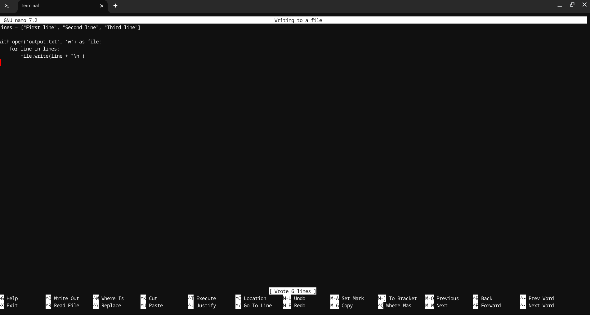

# SE-Assignment-6
 Assignment: Introduction to Python
Instructions:
Answer the following questions based on your understanding of Python programming. Provide detailed explanations and examples where appropriate.

 Questions:

1. Python Basics:
   - What is Python, and what are some of its key features that make it popular among developers? Provide examples of use cases where Python is particularly effective.

   Answer : 
   Python is a high-level, interpreted programming language known for its simplicity and readability. It supports multiple programming paradigms, including procedural, object-oriented, and functional programming. 
   
   Some key features of Python are:
Easy to learn and use: Python's syntax is straightforward, making it accessible to beginners.
Extensive standard library: Python has a vast standard library that includes modules for various tasks such as web development, data analysis, and more.
Dynamic typing and memory management: Python handles type checking at runtime and has automatic memory management.
Interpreted language: Python code is executed line by line, which makes debugging easier.
Community and support: Python has a large and active community, providing a wealth of resources and libraries.

Examples of use cases:
Web development: Using frameworks like Django and Flask.
Data science and machine learning: With libraries such as Pandas, NumPy, and Scikit-learn.
Automation and scripting: Automating repetitive tasks and writing scripts for system administration.
Game development: Using libraries like Pygame.

2. Installing Python:
   - Describe the steps to install Python on your operating system (Windows, macOS, or Linux). Include how to verify the installation and set up a virtual environment.

   Answer:
Linux (Chromebook with Linux):

1.Open the terminal.
2.  Update the package list:

3. Install Python:

4. Verify the installation:

5. Install pip (Python package installer):

6. Set up a virtual environment:

3. Python Syntax and Semantics:
   - Write a simple Python program that prints "Hello, World!" to the console. Explain the basic syntax elements used in the program.

   Answer:  

   print("Hello, World!")

print(): A built-in function to output text to the console.
"Hello, World!": A string, enclosed in double quotes.

4. Data Types and Variables:
   - List and describe the basic data types in Python. Write a short script that demonstrates how to create and use variables of different 
   data types.

answer: 
   Basic data types in Python:

int: Integer type, e.g., 42
float: Floating-point number, e.g., 3.14
str: String type, e.g., "Hello"
bool: Boolean type, e.g., True or False

the script : 

5. Control Structures:
   - Explain the use of conditional statements and loops in Python. Provide examples of an `if-else` statement and a `for` loop.

Answer:  
Conditional statements and loops are control structures that direct the flow of execution.

example of an if-else statement: 
age = 18
if age >= 18:
    print("You are an adult.")
else:
    print("You are a minor.")

Example of a for loop:
for i in range(5):
    print(i)

6. Functions in Python:
   - What are functions in Python, and why are they useful? Write a Python function that takes two arguments and returns their sum. Include an example of how to call this function.

   Answer:
Functions in Python are blocks of reusable code that perform a specific task. They help in organizing code and avoiding repetition.

Function to return the sum of two arguments:
def add(a, b):
    return a + b

# Calling the function
result = add(5, 3)
print(result)  # Output: 8

7. Lists and Dictionaries:
   - Describe the differences between lists and dictionaries in Python. Write a script that creates a list of numbers and a dictionary with some key-value pairs, then demonstrates basic operations on both.

   Answer:

List: An ordered collection of items, accessed by index.
Dictionary: An unordered collection of key-value pairs, accessed by key.

Script:

8. Exception Handling:
   - What is exception handling in Python? Provide an example of how to use `try`, `except`, and `finally` blocks to handle errors in a Python script.

Answer:
Exception handling in Python involves managing errors gracefully using try, except, and finally blocks.

Example:

9. Modules and Packages:
   - Explain the concepts of modules and packages in Python. How can you import and use a module in your script? Provide an example using the `math` module.

   Answer:

Module: A file containing Python code, which can include functions, classes, and variables.
Package: A collection of modules organized in directories.

Example using the math module:

10. File I/O:
    - How do you read from and write to files in Python? Write a script that reads the content of a file and prints it to the console, and another script that writes a list of strings to a file.

    Answer:
Reading from a file:
python script: 

Writing to a file:

# Submission Guidelines:
- Your answers should be well-structured, concise, and to the point.
- Provide code snippets or complete scripts where applicable.
- Cite any references or sources you use in your answers.
- Submit your completed assignment by [due date].

