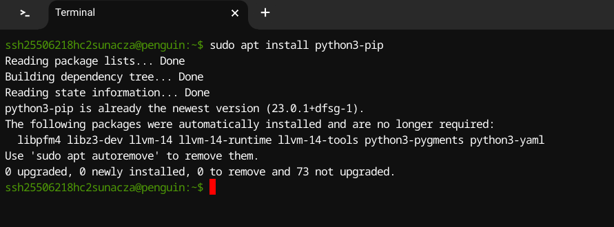
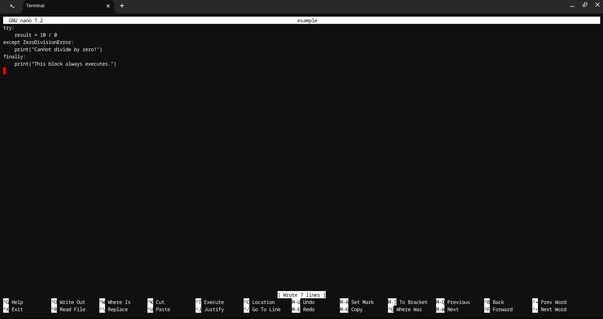

# SE-Assignment-5
Installation and Navigation of Visual Studio Code (VS Code)
 Instructions:
Answer the following questions based on your understanding of the installation and navigation of Visual Studio Code (VS Code). Provide detailed explanations and examples where appropriate.

 Questions:

1. Installation of VS Code:
   - Describe the steps to download and install Visual Studio Code on Windows 11 operating system. Include any prerequisites that might be needed.

   Answer:  Im using a linux chromebook, i opened the terminal and i ran these codes to download virtual studio code. 

Update Package List:

Before installing any new software, it's a good practice to update the package list.

                                                                                     
now to install the virtual studio code : 

Now to open Virtual studio code:

ssh25506218hc2sunacza@penguin:~$ code 

2. First-time Setup:
   - After installing VS Code, what initial configurations and settings should be adjusted for an optimal coding environment? Mention any important settings or extensions.

   Answer :  After installing VS Code, its good to optimize mmy coding environment with these initial configurations:

Setting up GitHub Integration:

Linking GitHub Account:
I Navigated to the Source Control view (Ctrl + Shift + G) and clicked on Sign in with GitHub.
Followed the prompts to authenticate my GitHub account. This allows seamless push and pull changes from GitHub repositories directly within VS Code.

Configuring Extensions:

I installed and enabled essential Extensions for Web Development:
ESLint: Ensure code quality and adhere to coding standards.
Live Server: Instantly see changes in the browser while editing HTML, CSS, and JavaScript.
GitLens: Enhances Git integration with features like blame annotations, repository history, and more.
Prettier: Automatically formats my code to maintain consistent style across my project.
I also installed python, python debugging, dart, flutter, code debugger.

Installing Extensions:
Open the Extensions view (Ctrl + Shift + X), search for each extension by name, and click Install.

3. User Interface Overview:
   - Explain the main components of the VS Code user interface. Identify and describe the purpose of the Activity Bar, Side Bar, Editor Group, and Status Bar.

   Answer: Understanding the main components of the VS Code interface:

Activity Bar: Provides quick access to different views such as Explorer, Search, Source Control, and Extensions.
Side Bar: Contains panels like Explorer (file browser), Search, Source Control (Git), and Extensions.
Editor Group: Displays open files and text editors in tabs or split views.
Status Bar: Shows information about the project, file, Git branch, and notifications.

4. Command Palette:
   - What is the Command Palette in VS Code, and how can it be accessed? Provide examples of common tasks that can be performed using the Command Palette.

   answer: The Command Palette (Ctrl + Shift + P) is a powerful tool in VS Code for executing commands:

Examples of Tasks:

Navigate to File/Symbol:
>File: Open File: Quickly open a specific file by typing its name.
>File: Open Folder: Open a new folder in VS Code.
>Go to Symbol in File: Navigate directly to a specific function or variable within the current file.

Editor Operations:
>Editor: Split Editor: Split the editor into multiple panes.
>Editor: Change Language Mode: Switch the language mode of the current editor.
>Editor: Toggle Word Wrap: Enable or disable word wrapping in the editor.

Source Control Management:
>Git: Clone: Clone a Git repository into your workspace.
>Git: Pull: Pull the latest changes from the remote Git repository.
>Git: Initialize Repository: Initialize a new Git repository in the current folder.

Extensions Management:
>Extensions: Install Extensions: Search for and install extensions from the VS Code Marketplace.
>Extensions: Show Installed Extensions: View all installed extensions and manage their settings.

5. Extensions in VS Code:
   - Discuss the role of extensions in VS Code. How can users find, install, and manage extensions? Provide examples of essential extensions for web development.

Answer:  Understanding the role and management of extensions:

Finding Extensions: Access the Extensions view (Ctrl + Shift + X), search for extensions by name or category, and install them with a single click.

Managing Extensions: Disable, uninstall, or update extensions directly from the Extensions view.

Essential Extensions: For web development, extensions like ESLint, Live Server, and Prettier are indispensable for maintaining code quality and productivity.

6. Integrated Terminal:
   - Describe how to open and use the integrated terminal in VS Code. What are the advantages of using the integrated terminal compared to an external terminal?

Answer: I use this command to open integrated terminal (`Ctrl + ``) effectively:

Advantages: Seamless integration with VS Code, access to shell commands without switching windows, and support for customization and multiple instances  

7. File and Folder Management:
   - Explain how to create, open, and manage files and folders in VS Code. How can users navigate between different files and directories efficiently?

   Answer: To Master file and folder operations within VS Code:

Creating Files/Folders: Right-click in the Explorer view, select New File or New Folder.

Opening Files: Double-click a file in Explorer or use Ctrl + P to search for and open files by name.

Navigating: Use the Explorer view to switch between files and folders. Utilize Ctrl + Tab to toggle between open files.

8. Settings and Preferences:
   - Where can users find and customize settings in VS Code? Provide examples of how to change the theme, font size, and keybindings.

   answer: Customize VS Code settings for an optimal coding experience:

Accessing Settings: Navigate to the bottom left to the settings icon and then seccelct the settings option .

Examples of Customization:
Theme: Choose a color theme (Color Theme).
Font Size: Adjust the font size (Editor: Font Size).
Keybindings: Modify keyboard shortcuts (Keyboard Shortcuts).

9. Debugging in VS Code:
   - Outline the steps to set up and start debugging a simple program in VS Code. What are some key debugging features available in VS Code?

   Answer: Setting up and starting debugging in Visual Studio Code (VS Code) is crucial for troubleshooting and improving the quality of my code. Here’s how I go about it:

### Setting Up Debugging in VS Code

**1. Install Necessary Extensions:**
Before diving into debugging, I ensure I have the necessary extensions installed based on the programming language or framework I'm using. For instance, I might need extensions like "Debugger for Chrome" for JavaScript debugging.

**2. Open My Project:**
I open VS Code and navigate to my project folder using `File > Open Folder`.

**3. Create a Launch Configuration:**
To configure debugging sessions, I create a `launch.json` file:
- I click on the Debug icon in the Activity Bar or press `Ctrl+Shift+D`.
- I click on the gear icon (⚙️) to create a `launch.json` file and select the environment (e.g., Node.js, Chrome).

**4. Configure `launch.json`:**
In `launch.json`

**5. Set Breakpoints:**
I strategically place breakpoints in my code by clicking in the gutter next to the line number in the editor.

### Starting Debugging Session

**1. Start Debugging:**
To initiate debugging, I click on the green play button in the Debug view or press `F5`. Alternatively, I select a specific configuration from the dropdown and click play.

**2. Control the Debug Session:**
During the debug session:
- **Step Over (`F10`)**: Executes the current line and moves to the next in the current file.
- **Step Into (`F11`)**: Moves into a function call or method.
- **Step Out (`Shift+F11`)**: Finishes executing the current function and returns to the caller.
- **Continue (`F5`)**: Resumes program execution until the next breakpoint or end.
- **Restart (`Ctrl+Shift+F5`)**: Stops and restarts the debug session.
- **Stop (`Shift+F5`)**: Terminates the debug session.

### Key Debugging Features in VS Code

- **Watch and Variables:** Inspect the current value of variables and expressions in real-time.
- **Call Stack:** Visualize the function call hierarchy.
- **Console:** Interact with the debugging session via the integrated console.
- **Conditional Breakpoints:** Trigger breakpoints based on specific conditions.
- **Debug Console:** Access a dedicated console for debugging purposes.
- **Exception Handling:** Configure VS Code to break on specific exceptions.

By effectively utilizing these steps and features, I can pinpoint and resolve issues within my code efficiently, thereby enhancing its quality and my overall development experience in Visual Studio Code.

10. Using Source Control:
    - How can users integrate Git with VS Code for version control? Describe the process of initializing a repository, making commits, and pushing changes to GitHub.

answer:   
### Integrating Git with VS Code for Version Control

**1. Initializing a Repository**

To start version controlling my project using Git in VS Code:

- **Open VS Code:** Navigate to my project folder by selecting `File > Open Folder`.

- **Open Integrated Terminal:** Press `Ctrl+` `to open the integrated terminal.

- **Initialize Git Repository:** In the terminal, I initialize a new Git repository using the `git init` command. This command sets up a new Git repository in my current directory.

**2. Making Commits**

After initializing the repository, I proceed to make commits to track changes in my project:

- **Stage Changes:** Use `git add` to stage files for the next commit. This command prepares files to be included in the next snapshot of my project's history.

- **Commit Changes:** Commit the staged changes using `git commit`. This command records the snapshot permanently in the project history with a descriptive message.

**3. Pushing Changes to GitHub**

Once I have made commits to my local repository, I can push these changes to a remote repository on GitHub:

- **Create a Repository on GitHub:** First, I create a new repository on GitHub.com.

- **Add Remote Repository:** Link my local repository to the remote repository on GitHub using `git remote add origin` followed by the GitHub repository URL.

Example (adding remote repository):
git remote add origin https://github.com/myusername/my-repo.git

- **Push Changes:** Finally, push the committed changes from my local repository to the remote repository on GitHub using `git push`.

Example (pushing changes):
git push -u origin main

### Key Concepts and Commands

- **git init:** Initializes a new Git repository.
- **git add:** Stages changes for the next commit.
- **git commit:** Records changes to the repository with a commit message.
- **git remote add:** Adds a remote repository URL to link the local repository to a remote repository.
- **git push:** Pushes committed changes from the local repository to the remote repository.

By following these steps and using these commands in VS Code, I effectively manage version control of my projects, track changes, collaborate with team members, and ensure project integrity using Git and GitHub integration.  

 Submission Guidelines:
- Your answers should be well-structured, concise, and to the point.
- Provide screenshots or step-by-step instructions where applicable.
- Cite any references or sources you use in your answers.
- Submit your completed assignment by 1st July 

